# Latihan Frontend — CRUD & Autentikasi (React + Express + PostgreSQL)

## 📘 Deskripsi Proyek
Proyek ini adalah aplikasi **Fullstack CRUD dengan sistem autentikasi JWT** menggunakan:
- **Frontend:** React.js + React-Bootstrap  
- **Backend:** Express.js + PostgreSQL  
- **Autentikasi:** JWT (JSON Web Token)  
- **Fitur:** Login, Register, dan CRUD (Tambah, Edit, Hapus, Tampil Data)  
- **UI:** Tema **ungu elegan**, modern, dan responsif  

Aplikasi ini dikembangkan sebagai latihan tugas integrasi **Frontend dan Backend**.

---

## 🏗️ Struktur Project
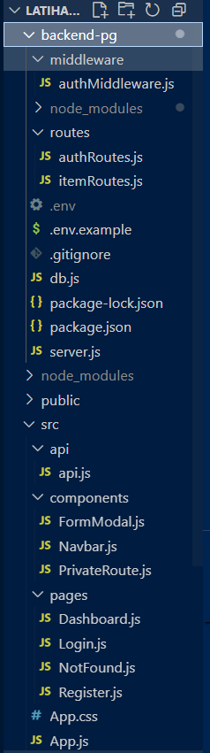


---

## ⚙️ Teknologi yang Digunakan

### 🔹 Frontend
- React.js
- React Router DOM
- React Bootstrap
- Axios
- SweetAlert2 (popup interaktif)

### 🔹 Backend
- Express.js
- PostgreSQL (`pg`)
- JWT (`jsonwebtoken`)
- bcryptjs
- dotenv
- cors
- nodemon

---

## 🧰 Instalasi & Setup

### 1️⃣ Clone Repository
```bash
git clone https://github.com/syahmirian/latihan-frontend.git
cd latihan-frontend

2️⃣ Setup Backend
cd backend-pg
npm install


Buat file .env berdasarkan contoh .env.example:

PORT=5000
JWT_SECRET=your_secret_key_here
PGUSER=postgres
PGPASSWORD=your_password_here
PGHOST=localhost
PGPORT=5432
PGDATABASE=latihan_frontend


Buat database di PostgreSQL:

CREATE DATABASE latihan_frontend;

CREATE TABLE users (
  id SERIAL PRIMARY KEY,
  name VARCHAR(100),
  email VARCHAR(100) UNIQUE,
  password VARCHAR(200)
);

CREATE TABLE items (
  id SERIAL PRIMARY KEY,
  title VARCHAR(200),
  description TEXT,
  user_id INTEGER REFERENCES users(id) ON DELETE CASCADE
);


Jalankan backend:

npm run dev

3️⃣ Setup Frontend
cd ..
npm install
npm start


Frontend berjalan di:
👉 http://localhost:3000

🔐 Fitur Utama
Fitur	Deskripsi
🔸 Register	Membuat akun baru
🔸 Login	Autentikasi dengan JWT
🔸 Private Route	Dashboard hanya untuk user login
🔸 CRUD	Tambah, Edit, Hapus, dan Lihat Data
🔸 Modal CRUD	Semua aksi CRUD dilakukan lewat modal
🔸 SweetAlert2	Popup sukses/gagal yang interaktif
🔸 UI clean, lembut, dan responsif

## 🖼️ Screenshot Aplikasi

### 🔹 Halaman Login
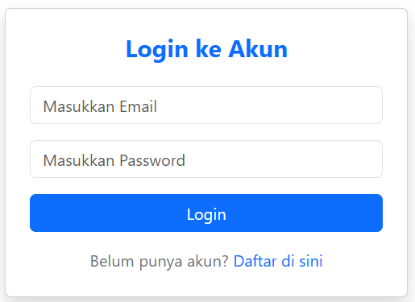
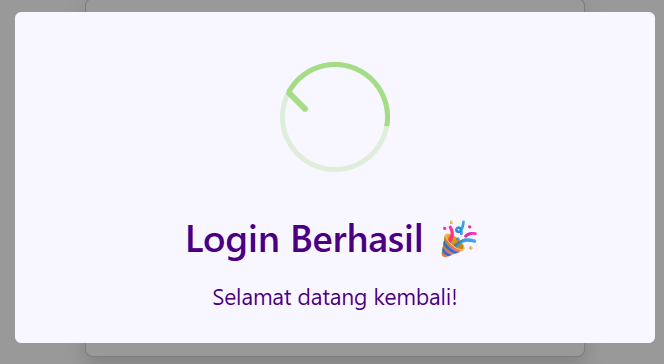

### 🔹 Halaman Register
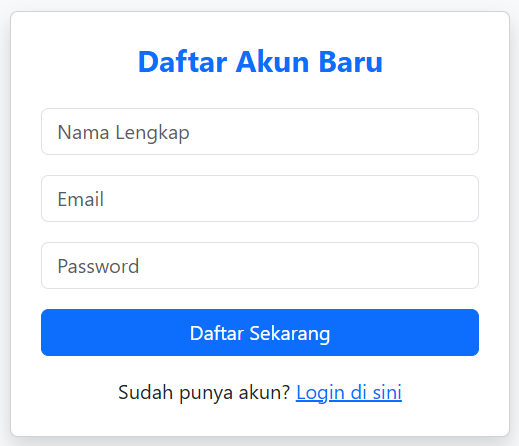
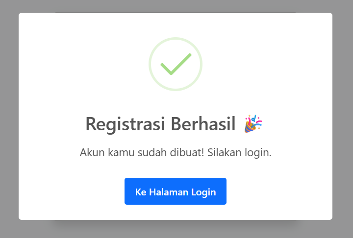

### 🏠 Dashboard
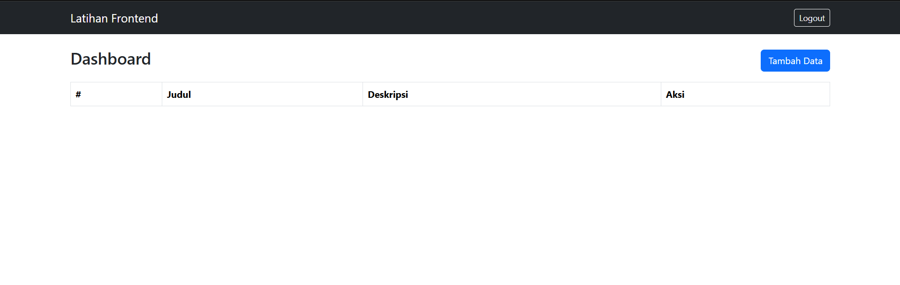

### ➕ Tambah Data
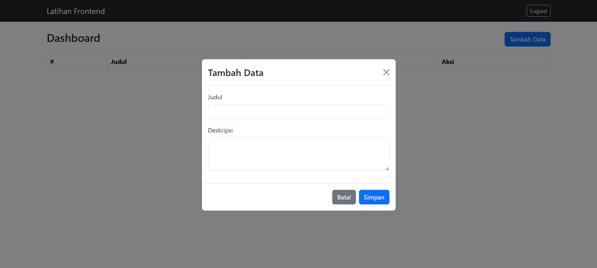
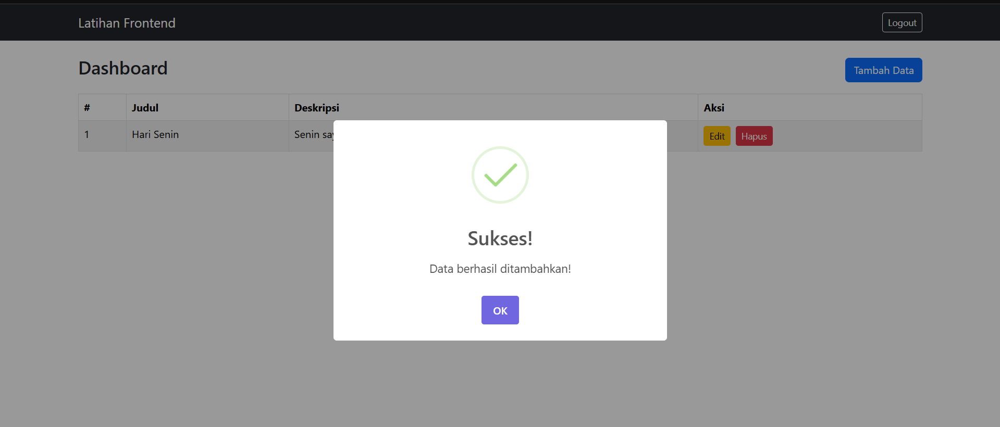

### ✏️ Edit Data
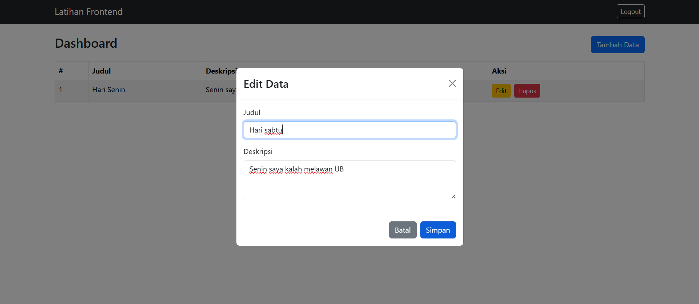
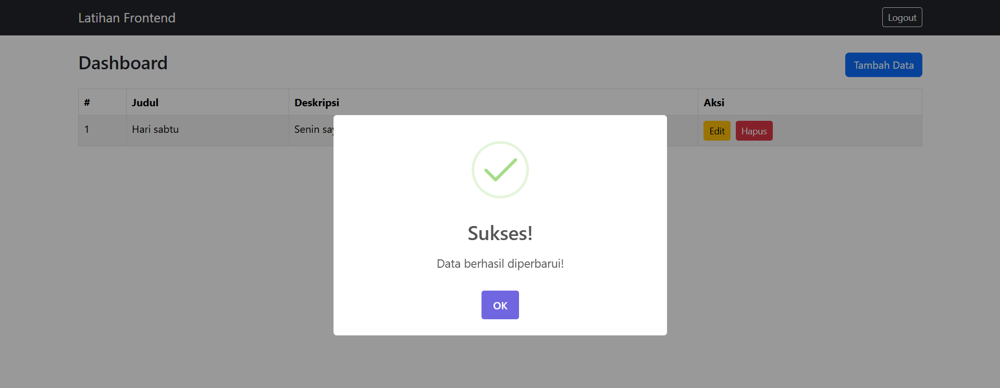

### 🗑️ Hapus Data
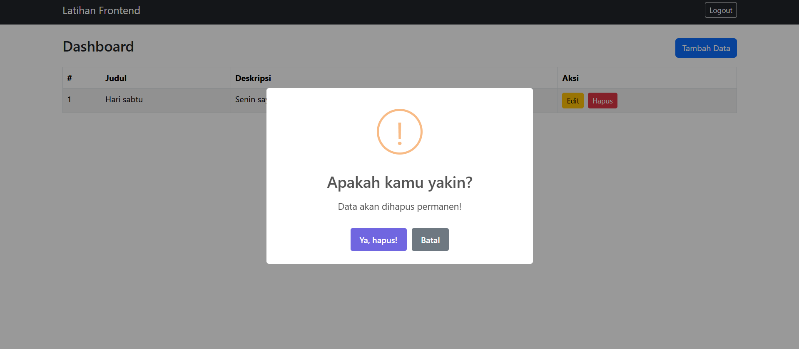
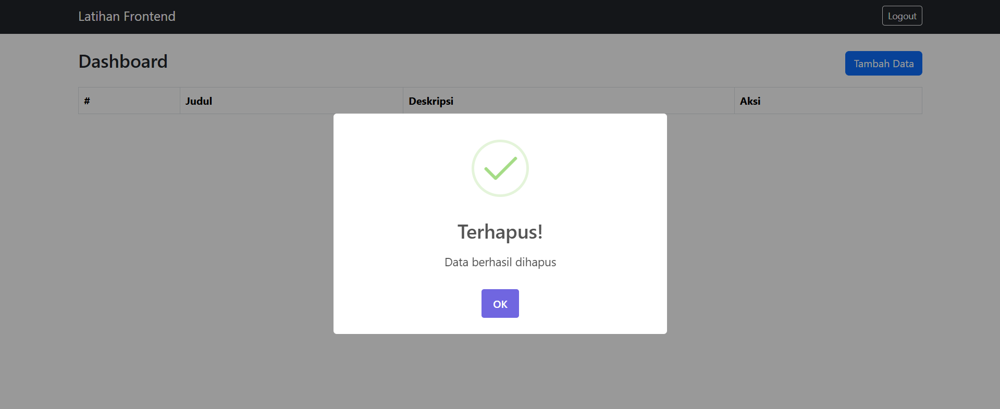

